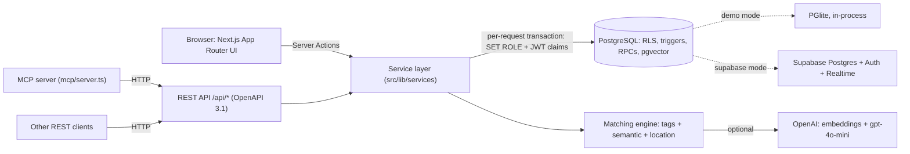

# Gata: service matchmaking marketplace

**Gata** ("done!" in Romanian) connects people who need something done with the people who can do it:
licensed tradespeople (electricians, plumbers, carpenters, developers, designers) *and* anyone who wants
to earn extra money with everyday help (cleaning, furniture assembly, moving, dog walking).

Clients post a job and receive bids. An **AI match score** ranks bidders and recommends workers.
Contact details unlock only after a bid is accepted (lead generation). Mutual reviews and community
reports with **auto-ban at 5 reports** keep the marketplace safe. Built for **VNUHack 2026: "Be the middleman"**.

> The UI is in Romanian (prices in lei). The code, API and docs are in English.

**Stack:** Next.js 16 (App Router, Server Actions) · React 19 · TypeScript · Tailwind CSS v4 · shadcn/ui + Radix ·
Supabase (Postgres, Auth, Realtime, RLS) · PostgreSQL + pgvector · OpenAI (embeddings + gpt-4o-mini) ·
OpenAPI 3.1 · MCP server · Docker

---

## Contents

- [Features](#features)
- [Quick start (demo mode, zero config)](#quick-start-demo-mode-zero-config)
- [Demo accounts](#demo-accounts)
- [5-minute pitch demo](#5-minute-pitch-demo)
- [Architecture](#architecture)
- [AI match score](#ai-match-score)
- [Security model](#security-model)
- [Supabase setup (production mode)](#supabase-setup-production-mode)
- [OpenAI](#openai)
- [Docker](#docker)
- [MCP server (AI assistants)](#mcp-server-ai-assistants)
- [REST API and OpenAPI](#rest-api-and-openapi)
- [Testing](#testing)
- [Deploying](#deploying)
- [Project structure](#project-structure)
- [Credits](#credits)

---

## Features

| Area | What's there |
| --- | --- |
| **Dual-role accounts** | One account, two modes: client and worker. A navbar toggle switches the dashboard between "posting jobs" and "finding work". |
| **Taxonomy** | Hierarchical categories split into **specialized** (licensed trades, IT and creative work) and **casual** (household help), with 17 service tags. Licence-required services (electrician, ANRE) are flagged. |
| **Jobs and bids** | Post a job with budget, category, tags, city or remote, and urgency. Workers bid with a price, duration and message. Owners compare bids side by side and accept or reject them. Statuses: `open → assigned → completed / cancelled`. |
| **AI match score (0–100)** | A hybrid of tag overlap, semantic similarity (OpenAI embeddings in pgvector, or a local Romanian NLP fallback) and location, with a licence penalty. It powers the "recommended workers" and "recommended jobs" lists and the bid comparison. An "Analizează cu AI" button gives a per-pair LLM analysis. |
| **Lead generation** | Phone, e-mail and internal chat unlock only for the two parties once a bid is accepted. Chat updates live (Supabase Realtime, or polling in demo mode). |
| **Reviews** | Mutual reviews after completion, tied to `(job_id, worker_id, service_id)`. Ratings per service and the average rating are kept up to date by a trigger. |
| **Reports and auto-ban** | Predefined reasons (fraud, no-show, unlicensed work, …). A trigger bans an account automatically at the 5th report (the threshold is configurable). Banned users cannot post jobs, bid or send messages, and they disappear from the feeds. |
| **Moderation panel** | Reports queue, manual ban/unban (with counter reset), "verified" badges, auto-ban threshold, demo reset. |
| **Monetization** | Ad banners for free users. **Premium, $9.99/month** (mock checkout): no ads, pinned jobs, boosted ranking and a "Promovat/Recomandat" badge on bids and profiles. |
| **UX** | Mobile-first, dark and light themes, optimistic UI, toasts, empty states, accessible Radix primitives. |
| **For developers** | REST API with an OpenAPI 3.1 spec (`/docs`), an MCP server for AI assistants, Docker image, 33 integration tests on real PostgreSQL. |

## Quick start (demo mode, zero config)

Requirements: **Node.js 22+**.

```bash
git clone https://github.com/mmandragiu/gata-marketplace.git
cd gata-marketplace
npm install
npm run dev
```

Open <http://localhost:3000> and click **Intră în cont** to pick a demo account.

Demo mode runs an **embedded PostgreSQL (PGlite) inside the Next.js process**. It applies the *same*
Supabase migration (schema, RLS policies, triggers, pgvector) and seeds the demo data at startup.
There are no external services, keys or Docker. State lives in memory: it resets when the server
restarts, or from **Admin → Resetează datele demo**.

## Demo accounts

One click on the login page in demo mode. In Supabase mode the password is `Demo1234!` (`DEMO_PASSWORD`).

| Account | Role | Notes |
| --- | --- | --- |
| `andreea.popescu@example.com` | Client · Cluj-Napoca | **Premium**: owns the electrical, IKEA, dog-walking and logo jobs |
| `mihai.ionescu@example.com` | Client · București | Free account (sees ads): owns the cleaning, website, plumbing and elderly-help jobs |
| `ion.marinescu@example.com` | Electrician (skilled) | **Premium**, verified, ANRE licence |
| `radu.stan@example.com` | Plumber (skilled) | Verified |
| `vlad.munteanu@example.com` | Carpenter + IKEA assembly (skilled) | Verified |
| `ioana.dumitru@example.com` | Developer (skilled) | Verified |
| `elena.georgescu@example.com` | Designer + photographer (skilled) | |
| `maria.constantin@example.com` | Cleaning, ironing, household help (casual) | |
| `andrei.pop@example.com` | IKEA assembly, moving, TV mounting (casual) | |
| `sorina.matei@example.com` | Dog walking, pet sitting, gardening (casual) | Has an assigned job with an active chat |
| `cristian.vasile@example.com` | Electrician | **Auto-banned** (5/5 reports) |
| `gelu.tudose@example.com` | Handyman, no licence | **4/5 reports**: one more report bans him live |
| `admin@example.com` | Moderator | Moderation panel |

The seed contains 13 accounts, 8 open jobs (electrical, cleaning, furniture assembly, dog walking, elderly help,
website, logo, plumbing), 22 bids, 16 reviews and 9 reports. All people, e-mails and phone numbers are fictional.

## 5-minute pitch demo

1. **Landing page**: live platform stats, categories, how it works.
2. **Log in as Andreea** (Premium client) → *Dashboard → Joburile mele →* "Înlocuire tablou electric…".
3. **Compare bids**: Ion is first (*Promovat* + *Verificat*, ANRE licence, AI score 100). Gelu has a low score
   and a licence warning. Cristian is banned, greyed out and cannot be accepted.
4. Click **Analizează cu AI** on Gelu's bid to see the strengths and concerns.
5. **Report Gelu** (**Raportează** → pick a reason). The 5th report **auto-bans him on the spot** (toast, and his bid greys out).
6. **Accept Ion's bid**. The job becomes *assigned*, Ion's **phone and e-mail unlock**, and the chat opens.
7. **Mark as completed → leave a review**. Ion's rating updates instantly (database trigger).
8. **Log in as Andrei** (worker). *Recommended jobs* are ranked by AI score. Place a bid.
9. **Log in as Mihai**. Ads are visible → **Premium** → activate. Ads disappear and his jobs get pinned.
10. **Log in as Admin**: reports queue, unban Gelu (counter reset), change the auto-ban threshold.
11. **For developers**: open `/docs` (OpenAPI). In Claude, ask *"find me a dog walker in Cluj"* through the MCP server.

## Architecture



- **One schema, two runtimes.** `supabase/migrations/*.sql` is the single source of truth. In demo mode it runs
  on PGlite with a small `auth` stub (`auth.users`, `auth.uid()`, the `anon`/`authenticated` roles). In Supabase mode
  it runs on the real thing.
- **RLS on every request.** The service layer opens a transaction per request and sets
  `role = authenticated|anon` plus `request.jwt.claims`, exactly like PostgREST. Every query is therefore checked
  by the same RLS policies, whether it comes from the UI, the REST API or MCP. Privileged operations (accept a
  bid, complete a job, review, auto-ban) are `SECURITY DEFINER` functions that validate the caller themselves.
- **Data modes** (`src/lib/config.ts`): `DATA_MODE=demo|supabase`. When it is unset, Supabase mode is used only
  if all of its variables are present. Supabase settings are read at runtime, so one build or Docker image works
  in every environment.
- **Auth:** Supabase Auth (cookies via `@supabase/ssr`, session refresh in `src/proxy.ts`), or an HMAC-signed
  demo session cookie in demo mode.
- **Realtime:** bids and messages are published to `supabase_realtime`. In demo mode the client polls instead.

## AI match score

```
score = round(100 × (0.55 · tag + 0.35 · semantic + 0.10 · location)) × (0.7 if a licence-required service is not covered)
rank  = score + Premium boost (+10, +5 per extra boost level)
```

- **tag**: the share of the job's service tags the worker offers (0.25 partial credit for the same category only).
- **semantic**: similarity between the job's free text and the worker's bio and portfolio.
  - **With `OPENAI_API_KEY`:** `text-embedding-3-small` embeddings stored in a **pgvector** table, cached by
    content hash (re-embedded only when the text changes) and compared with cosine distance in SQL.
  - **Without a key:** a local Romanian pipeline (diacritics folding, light stemming, concept expansion such as
    "tablou/priză/ANRE → electric", TF cosine), so the demo needs no network.
- **location**: same city or remote = 1, otherwise 0.3.
- **licence check**: electrical work requires the electrician tag *and* a declared licence, otherwise the score
  is cut by 30% and a warning is shown.
- **"Analizează cu AI"**: `gpt-4o-mini` in JSON mode, validated with zod, returns a verdict, strengths and
  concerns. Results are cached per (job, profile) content, and a local analysis is used if OpenAI fails.

Run `npm run matching:report` to print the ranking for every seeded job.

## Security model

- **RLS everywhere**, with `revoke all` on the public schema followed by explicit grants. Clients cannot read
  `profiles.report_count` (column-level grant).
- **Contacts** are readable only by the client and the accepted worker of a job (`can_view_contact`). **Messages**
  are readable only by the parties.
- **Bids** are visible to the job owner and their author only. Anonymous users see bid counts, not bids.
- **Banned users** are blocked in the database itself (RLS + RPC checks), not only in the UI. They cannot
  post, bid or chat, and their jobs and profiles are hidden from feeds and search.
- **Reports**: one per reporter per target, no self-reports. The auto-ban trigger reads the threshold from
  `moderation_settings`.
- **Reviews** are allowed only after completion, once per party per job. Averages are recomputed by a trigger.
- All input is validated with **zod**, and Postgres errors are mapped to clean API errors (`VALIDATION`,
  `FORBIDDEN`, `BANNED`, `CONFLICT`, …).

## Supabase setup (production mode)

1. Create a project at [supabase.com](https://supabase.com).
2. Apply the schema. Either paste `supabase/migrations/20261004120000_init.sql` into **SQL Editor → Run**, or use
   the CLI: `supabase link --project-ref <ref>` and then `supabase db push`. This creates the tables, RLS
   policies, triggers, RPCs, the `vector`/`unaccent` extensions, the Realtime publication and the categories and tags.
3. Copy `.env.example` to `.env.local` and fill in:
   ```bash
   DATA_MODE=supabase
   NEXT_PUBLIC_SUPABASE_URL=https://<ref>.supabase.co
   NEXT_PUBLIC_SUPABASE_PUBLISHABLE_KEY=sb_publishable_...   # or NEXT_PUBLIC_SUPABASE_ANON_KEY
   DATABASE_URL=postgresql://postgres.<ref>:<password>@aws-0-<region>.pooler.supabase.com:6543/postgres
   SUPABASE_SERVICE_ROLE_KEY=...                              # only needed by the seed script
   ```
4. Seed the demo data and accounts: `npm run db:seed`. Use `npm run db:seed -- --reset` to recreate them.
5. Optional: for instant sign-up, turn off **Authentication → Providers → Email → Confirm email**.
6. Run `npm run dev`. The demo banner disappears, and auth, realtime chat and bids now go through Supabase.

## OpenAI

Set `OPENAI_API_KEY` (and optionally `OPENAI_MODEL` and `OPENAI_EMBEDDING_MODEL`). `/api/health` reports
`"ai": "openai"` or `"local"`. The app works fully without a key.

## Docker

```bash
docker compose up --build        # demo mode → http://localhost:3000
```

For Supabase mode and/or OpenAI, put the variables in `.env` (see `.env.example`) and run the same command.
The multi-stage `Dockerfile` (Node 24, non-root, health check on `/api/health`) also works on its own:

```bash
docker build -t gata .
docker run -p 3000:3000 -e DEMO_SESSION_SECRET=$(openssl rand -hex 32) gata
```

## MCP server (AI assistants)

`mcp/server.ts` is a [Model Context Protocol](https://modelcontextprotocol.io) server (stdio). It lets Claude,
Cursor or any MCP client use the marketplace through the REST API. It is read-only and anonymous: no bids or
contacts are exposed.

| Tool | Description |
| --- | --- |
| `platform_health` | App status, data mode and AI mode |
| `list_categories` | Categories, services (tags), open jobs and workers per category |
| `search_jobs` | Search by text, category, tag, city, kind and status |
| `get_job` | Full job details |
| `search_workers` | Search workers by text, tag, city and kind |
| `get_worker` | Profile, services, portfolio, rating distribution, latest reviews |
| `recommend_workers` | AI-ranked workers for a job (score, Premium boost, matched/missing services, licence warning) |
| `analyze_match` | Detailed job–worker analysis (verdict, strengths, concerns) |

Start the app (`npm run dev`), then:

- **Claude Code:** the repo ships a `.mcp.json`, so open the folder in Claude Code and approve the `gata` server.
- **Claude Desktop:** add this to `claude_desktop_config.json`:
  ```json
  {
    "mcpServers": {
      "gata": {
        "command": "npx",
        "args": ["-y", "tsx", "/absolute/path/to/gata-marketplace/mcp/server.ts"],
        "env": { "GATA_API_URL": "http://localhost:3000" }
      }
    }
  }
  ```
  On Windows, if `npx` is not found, use `"command": "cmd"` with `"args": ["/c", "npx", "-y", "tsx", "C:\\path\\to\\gata-marketplace\\mcp\\server.ts"]`.
- **MCP Inspector:** `npx @modelcontextprotocol/inspector node --import tsx mcp/server.ts`
- **Smoke test** (calls every tool with the official SDK client): `npm run mcp:smoke`

## REST API and OpenAPI

Browsable docs live at **`/docs`**, and the spec is at **`/api/openapi`** (OpenAPI 3.1, 25 paths). Responses are
`{ "data": … }` or `{ "error": { "code", "message", "fieldErrors?" } }`. Authentication uses the same session
cookie as the UI.

| | Endpoints |
| --- | --- |
| Public | `GET /api/health`, `/api/categories`, `/api/jobs`, `/api/jobs/{id}`, `/api/jobs/{id}/recommendations`, `/api/workers`, `/api/workers/{id}`, `POST /api/match` |
| Signed in | `POST /api/jobs`, `GET/POST /api/jobs/{id}/bids`, `POST /api/bids/{id}/accept`, `POST /api/bids/{id}/reject`, `POST /api/jobs/{id}/complete`, `POST /api/jobs/{id}/cancel`, `GET/POST /api/jobs/{id}/messages`, `POST /api/reviews`, `POST /api/reports`, `GET /api/me`, `POST /api/me/role`, `POST /api/me/premium`, `GET /api/me/recommendations` |
| Admin | `GET /api/admin/reports`, `GET /api/admin/users`, `POST /api/admin/users/{id}/ban`, `POST /api/admin/users/{id}/unban`, `GET/PUT /api/admin/settings` |

## Testing

```bash
npm test              # 33 integration tests on real PostgreSQL (PGlite) with the actual migration
npm run typecheck     # next typegen + tsc
npm run lint
npm run build
npm run mcp:smoke     # with the app running
```

- `tests/services.test.ts` covers RLS (bids and contacts visibility, chat access), the full lifecycle (post → bid →
  accept → chat → complete → mutual reviews → rating trigger), banned-user restrictions at the database level,
  the 5th-report auto-ban, duplicate and self reports, the admin-only moderation panel, search filters, Premium,
  local AI matching (including the licence penalty) and concurrent transactions.
- `tests/openai.test.ts` runs the OpenAI path against an in-process mock of the OpenAI API: embeddings stored in
  pgvector and ranked by cosine similarity, re-embedding only changed texts, the JSON-mode LLM analysis with
  validation and caching, and the local fallbacks when the API fails or returns invalid output.
- `npm run test:pg` runs the same tests through **postgres.js, the driver used in Supabase mode**, against the
  database in `TEST_DATABASE_URL`. It must be a disposable local Postgres with pgvector, and **it is wiped**:
  ```bash
  docker run --rm -e POSTGRES_PASSWORD=pg -p 5433:5432 pgvector/pgvector:pg17
  TEST_DATABASE_URL=postgres://postgres:pg@localhost:5433/postgres npm run test:pg
  ```
  Set `DB_POOL_MAX=1` for servers that accept a single connection, such as PGlite's socket server.

## Deploying

- **Vercel + Supabase (recommended):** import the repo, set the variables from `.env.example` (use the transaction
  pooler `DATABASE_URL`, port 6543) and deploy. Migrations are applied once to Supabase (see above).
- **Demo mode on a server or in Docker:** works as is. Set `DEMO_SESSION_SECRET`. On serverless platforms each
  instance has its own in-memory database, so data can differ between instances and resets on cold starts.
  Use Supabase mode for anything public.

## Project structure

```
src/
  app/                  pages (landing, dashboard, jobs, workers, profile, premium, admin, docs, login)
    actions.ts          Server Actions (all UI mutations)
    api/                REST route handlers
  components/           UI (shadcn/ui in components/ui, third-party/ adapted MIT components)
  lib/
    services/           business logic: jobs, bids, chat, reviews, reports, admin, matching, profiles
    matching/           scoring engine, Romanian text similarity, OpenAI client
    db/                 PGlite (demo) and postgres.js (Supabase) adapters with per-request RLS
    seed/               demo dataset
    openapi.ts          OpenAPI 3.1 document
  proxy.ts              Supabase session refresh
supabase/migrations/    schema, RLS, triggers, RPCs, reference data
mcp/server.ts           MCP server
scripts/                Supabase seed, MCP smoke test, matching report
tests/                  integration tests
```

## Credits

- UI built with [shadcn/ui](https://ui.shadcn.com) on [Radix](https://www.radix-ui.com) primitives,
  [Lucide](https://lucide.dev) icons, [motion](https://motion.dev), [sonner](https://sonner.emilkowal.ski).
- Marquee, Continuous Tabs and Shimmer Button adapted from [Watermelon UI](https://ui.watermelon.sh) (MIT).
  Text Morph adapted from [Componentry](https://componentry.fun) (MIT).
- See [THIRD_PARTY_NOTICES.md](THIRD_PARTY_NOTICES.md).

## License

[MIT](LICENSE)
